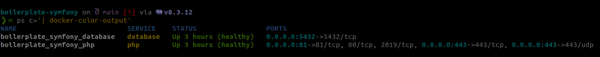

# Symfony Boilerplate

Based on the [Symfony Docker](https://github.com/dunglas/symfony-docker) project, this project provides a boilerplate for Symfony projects.

## Usefull tools

* [Docker-color-output](https://github.com/devemio/docker-color-output) to list the containers with colors

